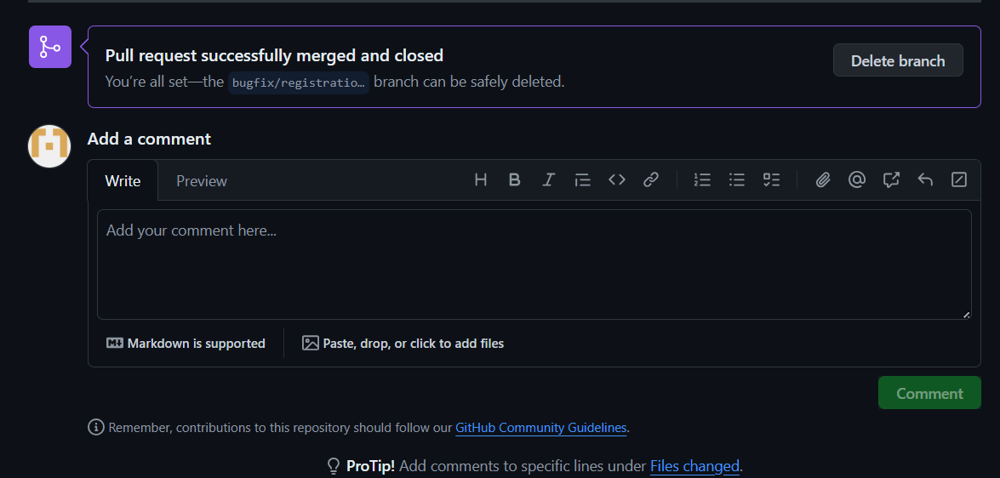

# Git-Example
- creating a simple express api for demonstration where the authentication will act as a login and registration will be as a register endpoint

### To create Branches

``` git branch develop ```

``` git branch feature/user-authentication ```

``` git branch bugfix/registration-from ```


### To switch Branches

``` git checkout develop ```

``` git checkout feature/user-authentication ```

``` git checkout bugfix/registration-from ```

--------------------------------------

To add all files and folder
``` git add . ```

To make a commit message
``` git commit -m "Commit message"  ```

To push the changes to the branch
``` git push origin branchname ```

### Demo code on branch that will later be merged 
- feature/user-authentication
```
const express=require("express")
const app=express()

app.use(express.json())


app.get("/login",(req,res)=>{

    res.json({"message":"You are visiting the login page"})

})


app.get("/register",(req,res)=>{

    res.json({"message":"You are visiting the register page"})

})

app.listen(process.env.PORT || 5000 , ()=>{
    console.log("Server is running")
})

```

----------------------
### Making bugfix branch conflicting


- Now manually fixing it

```
    res.json({"message":"You are visiting the register page"})

```

----------------------
# Making pr to develop branch from feature/user-authentication

- No conflicts to merge 


- Merged without errors


------------------------
# Making pr to develop branch from bugfix/registration-form


- No conflicts before merge


- After Merge


------------------------

# Merging the develop branch to the main branch


- Successful merge from develop to main


----------------------------------------

Started the tutorial from creating the repository and brushed up my version control and code management knowledge.
Merging the code without testing will lead to a code conflict thus leading to a bad code management.
Understanding Version Control and standards to follow the principles definately helps in managing large codebases.
